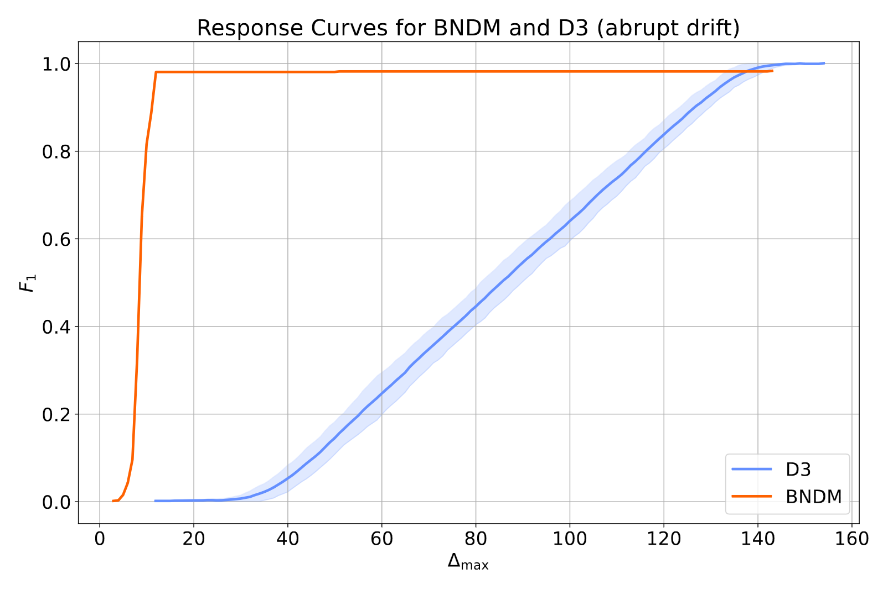

# Response Curves

## Abstract
Response Curves are a distance-based evaluation approach for concept drift detection combining information about the predictive performance with the time until detection and adaptation.
They are based based on the Time to Response (TTR), which is the (weighted) average of the time to detection and the time to adaptation pending a concept drift.
To determine true positives, false positives and false negatives, an acceptable maximum delay $\Delta_\text{max}$ is required.
Rather than choosing an arbitrary value, evaluating $\lim \Delta_\text{max} \to \infty$ allows the creation of \emph{Response Curves}, which provide more comprehensive information about a detector's behavior.
Response Curves can include information about both the TTR, and the correctness of the detection measured by metrics such as the $F_1$ score.
However, Response Curves require ground truth information about the concept drift.

Response Curves are suitable for abrupt, gradual and incremental concept drift and enable the evaluation of different detection approaches, including supervised and unsupervised concept drift detection.

The experiments provided in this repository show the value of response curves with the following examples:
- Example 1: Shows a comparison of two unsupervised concept drift detectors on a data stream with abrupt concept drift
- Example 2: Shows the tradeoff between timely and robust detection using different configurations of D3 on a data stream with abrupt concept drift
- Example 3: Shows that testing for concept drift less often can have a distinct effect on the predictive performance, although the computational performance will be much improved.
- Example 4: Shows that purging data windows after a concept drift was detected may not be advisable when dealing with incremental concept drift.
- Example 5: Shows that different approaches to concept drift detection, i.e., supervised and unsupervised, can be compared using Response Curves on a real-world data stream with ground truth information about the concept drift.

Submitted to Discovery Science 2024.
```
TODO
```



## Reproducing Results
To install the required dependencies and reproduce our results, follow these steps.
This study is implemented in `Python 3.10`.
1. Install dependencies, e.g., `pip install -r requirements.txt`
2. Execute `python main.py`
3. View the results, which are saved in 5 .pdf files

## Funding
This work was funded by the Volkswagen Stiftung (Volkswagen Foundation) and Niedersächsisches Ministerium für Wissenschaft und Kultur (Lower Saxony's Ministry for Science and
Culture) under Niedersächsisches Vorab (grant number ZN3683) and SPRUNG (grant number ZN3994).
